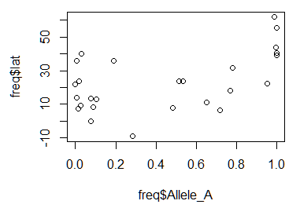

# 2. 1000 Genomes: Variation in rs1426654 SNP among human populations
We will now tackle a small data set of allele frequency variation among 26 global human populations in an SNP named rs1426654 located on chromosome 15. The gene, **SLC24A5** in which this SNP is located is involved in the regulation of skin pigmentation. In the following section, we will perform a range of analytical and graphical operations to understand this data better.

## 2.1 Import `freq.df` Allele Frequency Data
```
> getwd()
	[1] "C:/Users/lianx/Drives/E/work/Courses/2021Spring/BeyondBenchMOLB-5700/r4grads"

> options(width=150)

> freq <- read.table('freq.df', header=T)

> head(freq)
	pop  dist superpop     lat      long                  popname CHROM      POS N_ALLELES N_CHR  Allele_A Allele_G
	1 ACB 13.19      AFR 13.1776  -59.5412       African_Carib_BBDS    15 48426484         2   192 0.1041670 0.895833
	2 ASW -8.78      AFR 36.1070 -112.1130  African_Ancestry_SW_USA    15 48426484         2   122 0.1885250 0.811475
	3 BEB 23.68      SAS 23.6850   90.3563    Bengali_in_Bangladesh    15 48426484         2   172 0.5348840 0.465116
	4 CDX 22.01      EAS 22.0088 -100.7971              Chinese_Dai    15 48426484         2   186 0.0000000 1.000000
	5 CEU 62.28      EUR 39.3210 -111.0937 Utah_Resid_from_NWEurope    15 48426484         2   198 1.0000000 0.000000
	6 CHB 23.13      EAS 39.9042  116.4074              Han_Chinese    15 48426484         2   206 0.0291262 0.970874

> tail(freq)
	pop  dist superpop     lat     long               popname CHROM      POS N_ALLELES N_CHR  Allele_A  Allele_G
	21 PEL -9.19      AMR -9.1900 -75.0152              Peruvian    15 48426484         2   170 0.2823530 0.7176470
	22 PJL 31.55      SAS 31.5546  74.3572        Punjabi_Lahore    15 48426484         2   192 0.7812500 0.2187500
	23 PUR 18.22      AMR 18.2208 -66.5901          Puerto_Rican    15 48426484         2   208 0.7692310 0.2307690
	24 STU  7.87      SAS  7.8731  80.7718      Sri_Lankan_Tamil    15 48426484         2   204 0.4852940 0.5147060
	25 TSI 43.77      EUR 43.7711  11.2486         Toscani_Italy    15 48426484         2   214 0.9953270 0.0046729
	26 YRI 10.16      AFR  7.3775   3.9470 Yoruba_Ibadan_Nigeria    15 48426484         2   216 0.0138889 0.9861110

> names(freq)
	[1] "pop"       "dist"      "superpop"  "lat"       "long"      "popname"   "CHROM"     "POS"       "N_ALLELES" "N_CHR"     "Allele_A"  "Allele_G" 

> dim(freq)
	[1] 26 12
```

## 2.2 Accessing Rows and Columns
```
> freq[1:5,]
	pop  dist superpop     lat      long                  popname CHROM      POS N_ALLELES N_CHR Allele_A Allele_G
	1 ACB 13.19      AFR 13.1776  -59.5412       African_Carib_BBDS    15 48426484         2   192 0.104167 0.895833
	2 ASW -8.78      AFR 36.1070 -112.1130  African_Ancestry_SW_USA    15 48426484         2   122 0.188525 0.811475
	3 BEB 23.68      SAS 23.6850   90.3563    Bengali_in_Bangladesh    15 48426484         2   172 0.534884 0.465116
	4 CDX 22.01      EAS 22.0088 -100.7971              Chinese_Dai    15 48426484         2   186 0.000000 1.000000
	5 CEU 62.28      EUR 39.3210 -111.0937 Utah_Resid_from_NWEurope    15 48426484         2   198 1.000000 0.000000
	
> freq[,1:5]
	   pop  dist superpop     lat      long
	1  ACB 13.19      AFR 13.1776  -59.5412
	2  ASW -8.78      AFR 36.1070 -112.1130
	3  BEB 23.68      SAS 23.6850   90.3563
	4  CDX 22.01      EAS 22.0088 -100.7971
	5  CEU 62.28      EUR 39.3210 -111.0937
	6  CHB 23.13      EAS 39.9042  116.4074
	7  CHS 24.48      EAS 23.9790  113.7633
	8  CLM  6.24      AMR  6.2442  -75.5812
	9  ESN 10.22      AFR  9.0820    8.6753
	10 FIN 61.92      EUR 61.9241   25.7482
	11 GBR 56.49      EUR 55.3781   -3.4360
	12 GIH 22.26      SAS 22.2587   71.1924
	13 GWD 13.44      AFR 13.4432  -15.3101
	14 IBS 40.46      EUR 40.4830   -4.0876
	15 ITU 11.13      SAS 11.1271   78.6569
	16 JPT 35.69      EAS 35.6895  139.6917
	17 KHV 14.06      EAS 14.0583  108.2772
	18 LWK -0.02      AFR -0.0236   37.9062
	19 MSL  8.46      AFR  8.4606  -11.7799
	20 MXL 23.63      AMR 23.6345 -102.5528
	21 PEL -9.19      AMR -9.1900  -75.0152
	22 PJL 31.55      SAS 31.5546   74.3572
	23 PUR 18.22      AMR 18.2208  -66.5901
	24 STU  7.87      SAS  7.8731   80.7718
	25 TSI 43.77      EUR 43.7711   11.2486
	26 YRI 10.16      AFR  7.3775    3.9470

> freq[1:5, 1:5]
	  pop  dist superpop     lat      long
	1 ACB 13.19      AFR 13.1776  -59.5412
	2 ASW -8.78      AFR 36.1070 -112.1130
	3 BEB 23.68      SAS 23.6850   90.3563
	4 CDX 22.01      EAS 22.0088 -100.7971
	5 CEU 62.28      EUR 39.3210 -111.0937
```
## 2.3 Getting Summary Statistics
```
> range(freq$lat)
	
> range(freq$long)
	
> summary(freq$Allele_A)
	Min. 1st Qu.  Median    Mean 3rd Qu.    Max. 
	0.00000 0.04065 0.38382 0.43479 0.77825 1.00000 
	
> summary(freq$N_CHR)
	Min. 1st Qu.  Median    Mean 3rd Qu.    Max. 
	122.0   186.5   198.0   192.6   207.5   226.0
```

## 2.4 Histograms
```
> hist(freq$Allele_A)
```


```
> hist(freq$Allele_A, breaks=20)
```


```
> plot(freq$Allele_A, freq$lat)
```


```
plot(freq$Allele_A, freq$lat, xlab="f(A) rs1426654", 
     ylab="Latitude", pch=16, cex=0.8, col=freq$lat+10, xlim=c(0,1))
```


We will add a main title for the plot.

```
> plot(freq$Allele_A, freq$lat, xlab="f(A) rs1426654", ylab="Latitude", 
      pch=16, cex=0.8, col=myColors[freq$superpop], xlim=c(0, 1))
> legend('topleft', c('African', 'Admixed American', 'East Asia', 'European', 'South Asian'), 
        cex=0.8, col=c('red','blue','darkgreen','salmon','black'), pch=16, inset=0.02)
> title(main="Latitudinal Variation in f(A) at rs1426654 among 26 Human Populations", cex.main=1)
```


#3. Plotting Data on Geographical Maps
##3.1 Install/Load Packages
```
> install.packages("maps")
> install.packages("mapdata")
> install.packages("scales")
> install.packages("mapplots")
> library(maps)
> library(mapdata)
> library(scales)
> library(mapplots)
> install.packages('maps')

3.2 Draw World Map Layer
```
> map('worldHires', xlim=c(-120,142), ylim=c(-12,72), col='gray', fill=FALSE)
> box()


# 3.3 Plot Human Populations
We will plot the 26 human populations on this map using the geographical coordinates available to us.
```
> map('worldHires', xlim=c(-120,142), ylim=c(-12,72), col='gray', fill=FALSE)
> points(freq$long, freq$lat, pch=16, col="salmon")
> box()
```


# 3.4 Adjust Point Size
We could make this plot more informative if we linked the point size to allele frequency.
```
> map('worldHires', xlim=c(-120,142), ylim=c(-12,72), col='gray', fill=FALSE)
> points(freq$long, freq$lat, pch=16, cex=freq$Allele_A*1.5, col="Green")
> box()
```


# 3.5 Using Pie Charts to Display Relative Allele Frequencies
This would perhaps be the best way to depict our data on the map, because it will show relative frequencies of both alleles at every given geographical position (i.e. population).

First, let’s just draw one pie to see how it works. We can then apply the same principal to the remaining points on the map.
```
> map('worldHires', xlim=c(-120,142), ylim=c(-12,72), col='gray', fill=FALSE)
> add.pie(z=c(0.104, 0.895), x=-59.5412, y=13.1776, radius=192/100, col=c(alpha("orange", 0.6), alpha("blue", 0.6)), labels="")
> box()
```


# 3.6 Plot All Pie Charts Using `for{}` Loop
In order to plot one pie chart per population of data, what we need to do essentially is to cycle through the code above for each row of our data frame `freq.df`. 

```
> map('worldHires', xlim=c(-120,142), ylim=c(-15,72), col='gray', fill=FALSE)
> for (i in 1:26){
		add.pie(z=c(freq$Allele_A[i], freq$Allele_G[i]), x=freq$long[i], y=freq$lat[i], radius=freq$N_CHR[i]/100, col=c(alpha("orange", 0.6), alpha("blue", 0.6)), labels="")
		i=i+1
	}
> box()
```


There are several important bits of information depicted in this plot.

	1. Geographical positions of populations
	2. Size of the population under study (Pie circle size)
	3. The relative frequencies of the two alleles
All we need to do now is to add a legend and then the plot is ready.

# 3.7 Add Legend and Label Populations
```
map('worldHires', xlim=c(-120,142), ylim=c(-15,72), col='gray', fill=FALSE)
> for (i in 1:26){
	add.pie(z=c(freq$Allele_A[i], freq$Allele_G[i]), x=freq$long[i], y=freq$lat[i], radius=freq$N_CHR[i]/100, col=c(alpha("orange", 0.6), alpha("blue", 0.6)), labels="")
	i=i+1
	}
> text(freq$long, freq$lat, labels=freq$superpop, cex=0.5, pos=1)
> box()
> legend('topright', bty='1', c("Freq. Allele A", "Freq. Allele G"), pch=16, col=c(alpha("orange", 0.6), alpha("blue", 0.6)), pt.cex=1, cex=0.7)
> title(main="Global Distribution of rs1426654 Alleles", font.main=1, cex.main=0.9)
```


# 3.8 Save the Map Plot
We can save the code in a script `plots.R` to run and edit it later.
```
	pdf('WorldPie_Final2.pdf', width=10, height=7)

	map('worldHires', xlim=c(-120,142), ylim=c(-15,72), col='gray', fill=FALSE)


	for (i in 1:26){
		add.pie(z=c(freq$Allele_A[i], freq$Allele_G[i]), x=freq$long[i], y=freq$lat[i], 
        radius=freq$N_CHR[i]/100, col=c(alpha("orange", 0.6), alpha("blue", 0.6)), labels="")
		i=i+1
	}

	text(freq$long, freq$lat, labels=freq$superpop, cex=0.5, pos=1)

	box()

	legend('topright', bty='1', c("Freq. Allele A", "Freq. Allele G"), pch=16, 
        col=c(alpha("orange", 0.6), alpha("blue", 0.6)), pt.cex=1, cex=0.7)

	title(main="Global Distribution of rs1426654 Alleles", font.main=1, cex.main=0.9)

	dev.off()
```

Execute the script as follows. We can press 'ctrl + shit +s' as a shortcut in R studio.
```
> source("plots.R")
```